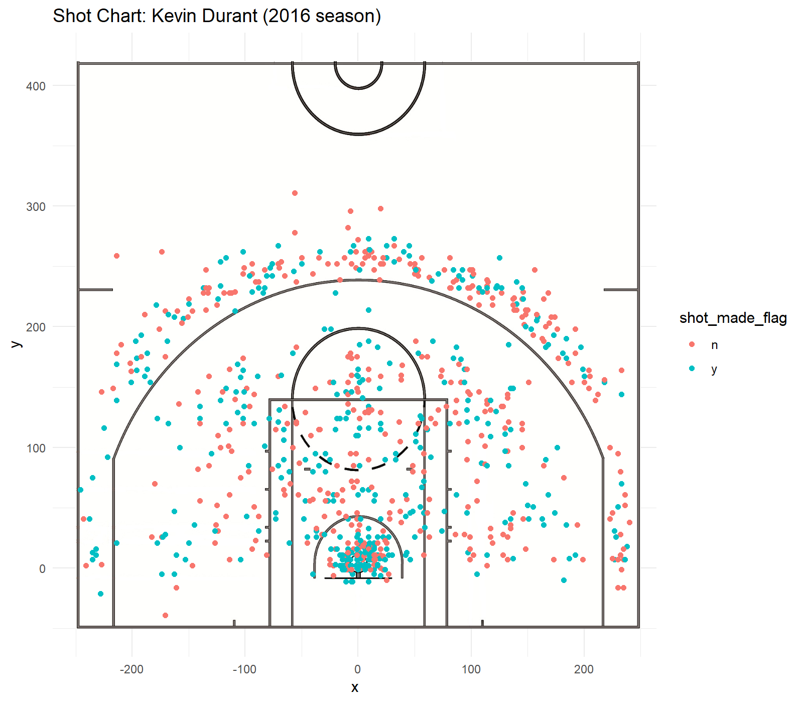
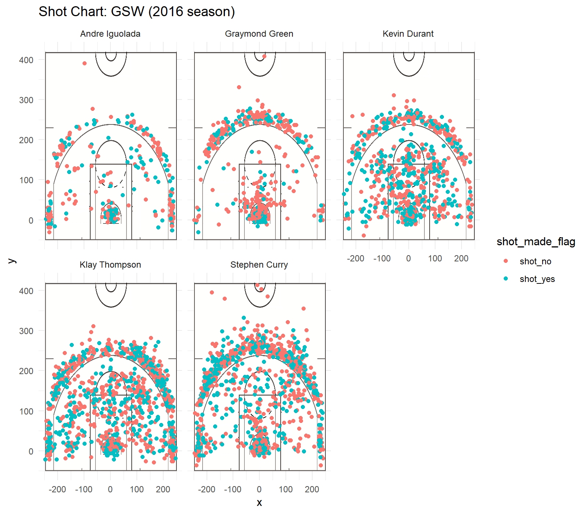

```{r echo=FALSE}
options(warn = -1) 
library(dplyr)
effective_shooting <- read.csv('../data/shots-data.csv',stringsAsFactors = FALSE)
arrange(summarise(group_by(effective_shooting,name),total = length(shot_type),made = sum(shot_made_flag == 'shot_yes'),perc_made = made / total ),desc(perc_made))
```
Part 1. Introduction\
    - NBA(National Basketball Association) founded in New York City,United States on June 6,1946,is the biggest basketball league in the US.It represents the highest level of the world basketball.It has the most talented superstars such as Michael Jordan,Kobe Bryant,Stephen Curry,Kevin Durant and Klay Thompson.\
    - GSW is a professional basketball team based in Oakland, California. The team's motto is "The whole team is a city." The Warriors are among the top four professional sports leagues in North America. The name does not include the main venue in the city, because the 1971 team wants to be the home of Oakland in Northern California and San Diego in Southern California, and is represented by California's nickname "Golden State". For the team in California, the team has won six league championships. In the 2015-16 season, the Golden State Warriors scored 73 wins and 9 losses, becoming the best record in the NBA history single season regular season, breaking the 1995-96 season Chicago Bulls 72 wins and 10 losses record. 2016-2017 season Warriors complement Former scoring champion Kevin Durant played the expected strength in the playoffs, effectively filling the scoring and defensive vacancies, and the team tied the record with 16 wins and 1 loss in the playoffs.\
    - This report mainly analyzes the shooting statistics of five GSW players during 2016 season:Andre Iguodala,Graymond Green,Klay Thompson,Kevin Durant and Stephen Curry.Furthermore, it predicts the potential value of each player as well as their best position.\
    
    
Part 2. Data Analysis\
    - First,I download the data and analyze the results of the 2016 season of the GSW five popular players from Internet.In each raw csv data file, there are 13 columns,including:team_name(which team the player belongs to),game_date(when the match holds),season(which NBA match season it is),period(which period the match is playing),minutes_remaining(minutes left in each period),seconds_remaining(seconds left in each period),shot_made_flag(whether the shoot is on or not),action_type,shot_type(1point,2points or 3points),shot_distance,opponent,x,y.\
    - Then,I mutate another two colunms:name and minutes to the raw csv data file.The name column explains the player's name while the minutes column tells the amount of time in minutes and seconds, respectively, that remained to be played in a given period.\
    - Also,in order to compare these five GSW players more convenient,I combine them into one shot_data csv file.Besides,I utilize scatterplot to see the relationship between hit rate and the shooting distance.(Take Kevin Durant for example)\
    - When I display all five scatterplots of each player,I find it hard to distinguish the strengths and weaks of each one.Therefore,I utilize the fuction facet_wrap to display a scatterplot of all these five players.\
     - From the graph below,we can see that Kevin Durant,Klay Thompson and Stephen Curry are more likely to shoot than Andre Iguodala and Graymond Green.Nevertheless,told by the format above and compared their shootings based on 2points field goal,Kevin Durant hits most accurately in this season.\

     
```{r out.width='80%',echo=FALSE,fig.align='center'}
options(warn = -1)
library(dplyr)
library(ggplot2)
library(jpeg)
library(grid)
durant <- read.csv("../data/kevin-durant.csv",stringsAsFactors = FALSE)
court_file <- "../images/nba-court.jpg"
court_image <- rasterGrob(
  readJPEG(court_file),
  width = unit(1, "npc"),
  height = unit(1, "npc"))
durant_shot_chart <- ggplot(data = durant) +
  annotation_custom(court_image, -250, 250, -50, 420) +
  geom_point(aes(x = x, y = y, color = shot_made_flag)) +
  ylim(-50, 420) +
  ggtitle('Shot Chart: Kevin Durant (2016 season)') +
  theme_minimal()
png(filename = 'durant-shot-chart.png',width = 8, height = 7,units = 'in',res = 200)
durant_shot_chart
dev.off()

```
    
    
    
```{r out.width='80%',echo=FALSE,fig.align='center'}
options(warn = -1)

```
   
    
    
Part 3. Data Discussion\
    - In the game against the Pacers, Klay Thompson scored 39 points, 7 rebounds and 6 assists. From the data point of view, projection is the biggest value of Thompson. However, his offensive technique is relatively simple and lacks skillful possession. Technology, he can not play the role of the ball handler.Due to the lack of self-defense techniques, Thompson has difficulty getting free throws. The lack of breakthroughs and fouls have also affected Thompson's true shooting percentage.As for the defensive aspect, Thompson has excellent defensive awareness and traverse speed, which can withstand most of the small forwards and defenders in the league.\
    - Kevin Durant is the first player to have scored 30+ points and 15+ rebounds in a single season since Anthorn Jamison in the 2000-01 season. His ball-handling skills are very skillful and can create scoring opportunities anywhere.\
    - Andre Iguodala has a strong physical strength and a strong air. Nowadays, he is an all-around warrior: dribble, breakthrough, fast break, defense, pass.\
    - On March 31, 2016, the Warriors beat the Jazz 103-96 in overtime. Graymond Green played 43 minutes and scored 13 points, 8 rebounds, 6 assists and 3 blocks. He is the core of the Warriors' defense on the court twice and has been selected for the league's best defense for a while.\
    - On March 8, 2016, the Warriors beat the Magic at 119-113. Stephen Curry played 37 minutes and scored 41 points, 13 rebounds and 3 assists. In addition, Curry averaged the first in the league in scoring and steals.On May 10, 2016, the second round of the playoffs, the Warriors away 132-125 win over the Trail Blazers, Curry came off the bench for 36 minutes, got 40 points, 9 rebounds and 8 assists, which scored 17 points in overtime, refreshed NBA plus Single-time individual score record.Curry is good at long-range shooting. His breakthrough is based on dexterity and skill: staggering the opponent's footsteps and breaking the opponent with time difference. At the same time, Curry's possession of the ball is extremely good.\
    
    
Part 4. Conclusion\
    - These five GSW players have different potentials according to their different performances and scores on the field.\
    - Stephen Curry is my favorite basketball player.He is regarded as a Point Guard.Actually, in my opinion, Curry is not a real traditional PG. His projection power is too powerful to easily attract the opponent's defensive pinch.He is also very good at creating scoring opportunities for his teammates. However, because Curry often takes the risk of passing, he is very easy to make mistakes. \
    - Klay Thompson is regarded as Shooting Guard and Kevin Durant is regarded as Small Forward. Also, Andre Iguodala is regarded as both Shooting Guard and Small Forward. Graymond Green is regarded as Big Forward.\
    

*references*\
    - *<https://zh.wikipedia.org/wiki/Golden_State_Warriors>*\
    - *<https://on.nba.com/2Vv1t2u>*\
    - *<https://bit.ly/2HcDJMD>*\
    - *<https://bit.ly/2BWTmoc>*\
    